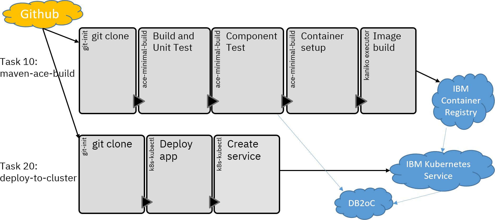

# ACE demo pipeline

Demo pipeline for ACE to show how ACE solutions can be built in CI/CD pipelines using standard 
tools. The main focus is on how to use existing ACE capabilities in a pipeline, with the application
being constructed to show pipeline-friendliness rather than being a "best practice" application.

## Constituent parts

- This repo, containing the application source and tests plus the DB2 client JAR.
- Maven for building applications and running JUnit tests
- Tekton for running builds in a cloud
- Docker container build files in this repo for building the application image (see tekton/Dockerfile)
- IBM Cloud container registry (free tier) for hosting the application image
- IBM Cloud Kubernetes cluster (free tier) for running the application container
- DB2 on Cloud (free tier) for use by the application container; credentials stored in Kubernetes secrets

 This repo can also be built using a GitHub action for CI enablement. It is also possible to run the
 pipeline using OpenShift with RedHat OpenShift Pipelines instead of using the IBM Cloud Kubernetes 
 service, and the instructions contain OpenShift-specific sections for the needed changes. 

 There is also a variant of the pipeline that uses the IBM Cloud Pak for Integration and creates
 custom resources to deploy the application (amongst other changes). See the 
 [CP4i README](tekton/os/cp4i/README.md) for details and instructions.
 
 Jenkins can also be used to run the pipeline and deploy the application to an integration node.
 See the [Jenkins README](demo-infrastructure/README-jenkins.md) for details and instructions.
 
 Note that the Tekton pipeline can also create temporary databases for use during pipeline runs; see 
 [temp-db2](tekton/temp-db2/README.md) for more details.
 
## The application

The application used to demonstrate the pipeline consists of a REST API that accepts JSON and interacts 
with a database, with a supporting shared library containing a lot of the code. It is designed around 
indexing different types of tea, storing the name and strength of the tea and assigning a unique integer 
id to each type so that it can be retrieved later. Audit data is logged as XML for each operation performed.

This repo can be imported into the ACE v12 toolkit using the egit plugin (included in the ACE v12 toolkit)
and inspected; as most pipelines would be expected to work with source repositories, there is no project 
interchange file to import for the projects.

As this application exists to help demonstrate pipelines and how they work with ACE, there are some shortcuts 
in the code that would not normally be present in a production-ready application: the database table is 
created on-demand to make setup easier, the logging goes to the console instead of an audit service, etc. 
Maven is used for many builds but the configuration is deliberately constructed to make the steps as explicit
as possible, bash is used for other builds scripts, etc.

## The tests

Unit tests reside in TeaRESTApplication_UnitTest along with their own test data.

Component testing is run from TeaRESTApplication_ComponentTest and relies on JDBC connections.

## How to get started with IBM Cloud

To replicate the pipeline locally, do the following:

1) Fork this repo and then clone it locally; although cloning it locally straight from the ot4i repo would allow building locally, for the pipeline itself to work some of the files need to be updated. The source also needs to be accessible to the IBM Cloud Kubernetes workers, and a public github repo forked from this one is the easiest way to do this. Cloning can be achieved with the git command line, or via the ACE v12 toolkit; the ACE v12 product can be downloaded from [the IBM website](https://www.ibm.com/marketing/iwm/iwm/web/pickUrxNew.do?source=swg-wmbfd).
2) Acquire an IBM Cloud account and create a Kubernetes cluster called "aceCluster", a Docker registry, and a DB2 on Cloud instance. More info in [cloud resources description](demo-infrastructure/cloud-resources.md).
3) Build the pre-req docker images and create the required credentials; see instructions in the [demo-infrastructure](demo-infrastructure) and [tekton/minimal-image-build](tekton/minimal-image-build) directories.
4) Component testing relies on the same DB2 on Cloud instance as the eventual application image; this is not a best practice, but does keep the demo simpler to get going, and so getting the DB2 instance credentials set up in Kubernetes and/or locally is necessary for the component tests.
5) Try running the pipeline using the instructions in the [tekton](tekton) directory.
6) Optionally, enable GitHub actions; this requires a GitHub instance that supports actions (not all Enterprise variants do), and credit enough to run the actions.
