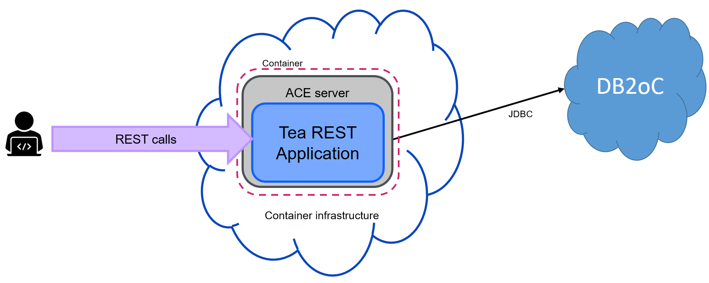
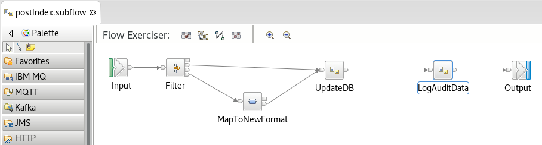
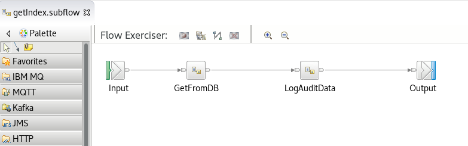

# Tea index REST application

This application presents a minimal REST API for storing and retrieving different types of tea.



Basic curl commands to store and retrieve a type of tea:
```
curl -X POST --data '{"name": "Assam", "strength": 5}' http://173.193.79.84:31531/tea/index
curl http://173.193.79.84:31531/tea/index/1
```

Can be run locally as well as in the cloud, and for full details this repo should be pulled into an ACE 12.0.4.0 toolkit (via the egit plugin) and examined there.

## Implementation

POST subflow:



The main database logic is implemented in the "UpdateDB" subflow, and the audit logging in "LogAuditData", with both of these residing in TeaSharedLibrary for easier testing. "MapToNewFormat" is a mapping node that converts from an older schema ("milk": true/false instead of "strength":number) into the new schema; the map is contained in this application, and testing it is left as an exercise for the reader . . .


GET subflow:



Similar to the POST subflow, the main logic is in subflows in TeaSharedLibrary.
