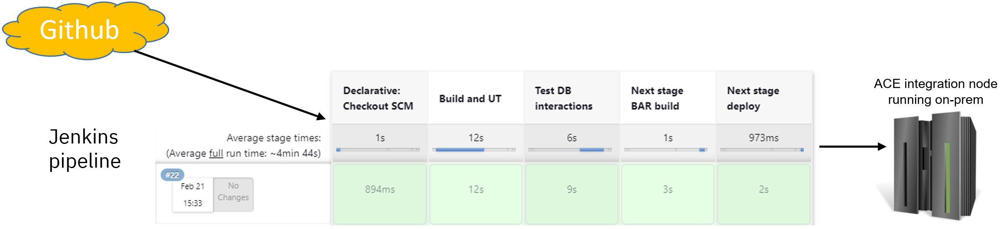
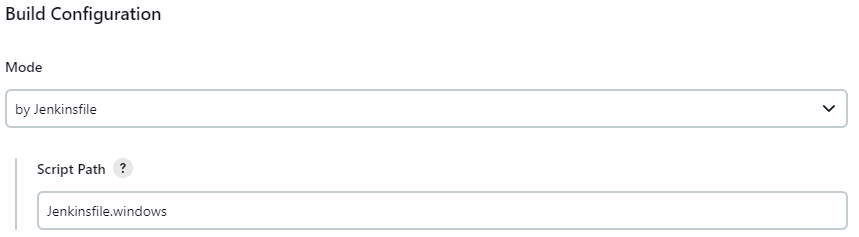
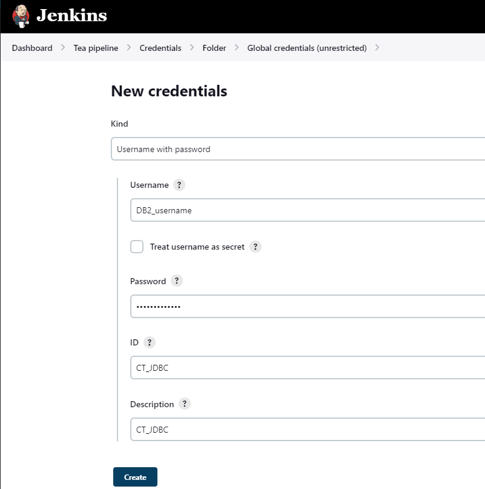

# Jenkins pipeline

Used to run the pipeline stages via Jenkins. Relies on an existing integration node being available with the JDBC
credentials having been set up, and will run on Windows or via docker on Unix platforms.



## Running Jenkins

Jenkins can be run from a command line (using Java11) as follows once downloaded:
```
java -jar jenkins.war --httpPort=8080
```
See https://www.jenkins.io/doc/pipeline/tour/getting-started/ for details and download locations.

## Getting started with the pipeline

Forking this repo is advisable, as then it can be modified to use the correct database location
and integration node. In the fork, the following values should be changed in either Jenkinsfile
or Jenkinsfile.windows depending on which platform is used:
- databaseName
- serverName
- portNumber
- integrationNodeHost
- integrationNodePort
- integrationServerName

For Windows, the ACE_COMMAND environment variable may need to be changed to match a locally-installed
version of ACE (currently set to 12.0.7). Container support is not required.

For Linux, the ACE build container image may need to be created first. The use of a container 
to run ACE commands ensures that the Jenkins environment (for example, Java level) does not
affect ACE commands, and ensures a consistent environment for building ACE artifacts. 
See the [ace-minimal-build](/demo-infrastructure/docker/ace-minimal-build) directory for 
information on building the image.

Once those values have been updated and containers built if needed, then the pipeline can be 
constructed, but it may be a good idea to change "GitHub API usage" under "Configure System" 
in the Jenkins settings as otherwise messages such as the following may appear regularly:
```
17:07:37 Jenkins-Imposed API Limiter: Current quota for Github API usage has 52 remaining (1 over budget). Next quota of 60 in 58 min. Sleeping for 4 min 9 sec.
17:07:37 Jenkins is attempting to evenly distribute GitHub API requests. To configure a different rate limiting strategy, such as having Jenkins restrict GitHub API requests only when near or above the GitHub rate limit, go to "GitHub API usage" under "Configure System" in the Jenkins settings.
```

To create the pipeline (and following the Jenkins pipeline tour instructions), a "multibranch 
pipeline" should be created and pointed at the github repo. For Windows users, the pipeline 
should be configured to look for `Jenkinsfile.windows`, while the default of `Jenkinsfile` is
appropriate for other platforms:



If the default `Jenkinsfile` is used, then Jenkins is likely to ask for Docker support on
Windows, which is not necessary: the Windows configuration will run ACE commands directly
without needing a container. Docker support is require on Linux, as described above.

Once the pipeline has been created and branches configured, the JDBC credentials need to be provided
as a username/password credential called `CT_JDBC`. The credentials can be spcified for the pipeline
using the Jenkins UI:



As well as creating the Jenkins credentials, the same values must be provided to the destination
integration node along with a JDBC policy called TEAJDBC. Using mqsisetdbparms for the 
credentials would look as follows:
```
mqsisetdbparms <integration node> -n jdbc::tea -u <db2user> -p <db2password>
```
and the policy should look like
```
<?xml version="1.0" encoding="UTF-8"?>
<policies>
  <policy policyType="JDBCProviders" policyName="TEAJDBC" policyTemplate="DB2_91_Linux">
    <databaseName>BLUDB</databaseName>
    <databaseType>DB2 Universal Database</databaseType>
    <databaseVersion>11.5</databaseVersion>
    <type4DriverClassName>com.ibm.db2.jcc.DB2Driver</type4DriverClassName>
    <type4DatasourceClassName>com.ibm.db2.jcc.DB2XADataSource</type4DatasourceClassName>
    <connectionUrlFormat>jdbc:db2://[serverName]:[portNumber]/[databaseName]:user=[user];password=[password];</connectionUrlFormat>
    <connectionUrlFormatAttr1></connectionUrlFormatAttr1>
    <connectionUrlFormatAttr2></connectionUrlFormatAttr2>
    <connectionUrlFormatAttr3></connectionUrlFormatAttr3>
    <connectionUrlFormatAttr4></connectionUrlFormatAttr4>
    <connectionUrlFormatAttr5></connectionUrlFormatAttr5>
    <serverName>19af6446-6171-4641-8aba-9dcff8e1b6ff.c1ogj3sd0tgtu0lqde00.databases.appdomain.cloud</serverName>
    <portNumber>30699</portNumber>
    <jarsURL></jarsURL>
    <databaseSchemaNames>useProvidedSchemaNames</databaseSchemaNames>
    <description></description>
    <maxConnectionPoolSize>0</maxConnectionPoolSize>
    <securityIdentity>tea</securityIdentity>
    <environmentParms>sslConnection=true</environmentParms>
    <jdbcProviderXASupport>false</jdbcProviderXASupport>
    <useDeployedJars>true</useDeployedJars>
  </policy>
</policies>
```
and be deployed to the default policy project for the integration server specified above.

## Running the pipeline and validating the results

Assuming the pipeline parameters have been modified in the Jenkinsfile, the pipeline can be run
using "Build with Parameters" on the desired branch. This should start the pipeline, which will
then pull the source down, compile and test it, and then deploy it to the integration node.

If the pipeline fails immediately with logs ending in
```
...
[Pipeline] // node
[Pipeline] End of Pipeline
ERROR: CT_JDBC
Finished: FAILURE
```
then this is usually a credentials issue; verify that the credentials are created correctly
with the correct name and contents.

Once the pipeline has completed successfully, the application can be tested by using a browser
or curl to access the application API endpoint at http://localhost:7800/tea/index/1 (assuming a
node without MQ on the default HTTP per-server listener port), which is likely to return null
values unless there is data in the database already:
```
C:\>curl http://localhost:7800/tea/index/1
{"name":null,"id":"1"}
```

To add tea to the index, curl can be used:
```
curl -X POST --data '{"name": "Assam", "strength": 5}' http://localhost:7800/tea/index
```
## Common errors

Incorrect credentials in Jenkins can cause component test failures while leaving the unit 
tests running successfully.

Missing TEAJDBC policy in the integration node causes runtime errors:
```
BIP2230E: Error detected whilst processing a message in node &apos;gen.TeaRESTApplication.getIndex (Implementation).GetFromDB.Get DB record&apos;. <br>
BIP6253E: Error in node: getIndex (Implementation).GetFromDB.Get DB record. Could not locate JDBC Provider policy
&apos;TEAJDBC&apos;, in the specified or default policy project, for the data source name property on this node.
```

Missing JDBC credentials shows a different runtime error:
```
BIP2230E: Error detected whilst processing a message in node &apos;gen.TeaRESTApplication.getIndex (Implementation).GetFromDB.Get DB record&apos;. <br>
BIP6278E: Node &apos;getIndex (Implementation).GetFromDB.Get DB record&apos; is unable to create a connection 
with the datasource represented by JDBCProviders policy name &apos;TEAJDBC&apos;, because of incomplete configuration
settings. The JDBCProviders policy has been configured with securityIdentity property value &apos;tea&apos;, which 
has not been defined by using the mqsisetdbparms or mqsicredentials command.
```

## Possible enhancements

The pipeline could use a configuration file to contain the DB2 database location and the location of the 
integration node, all of which are currently parameters for the pipeline itself.
