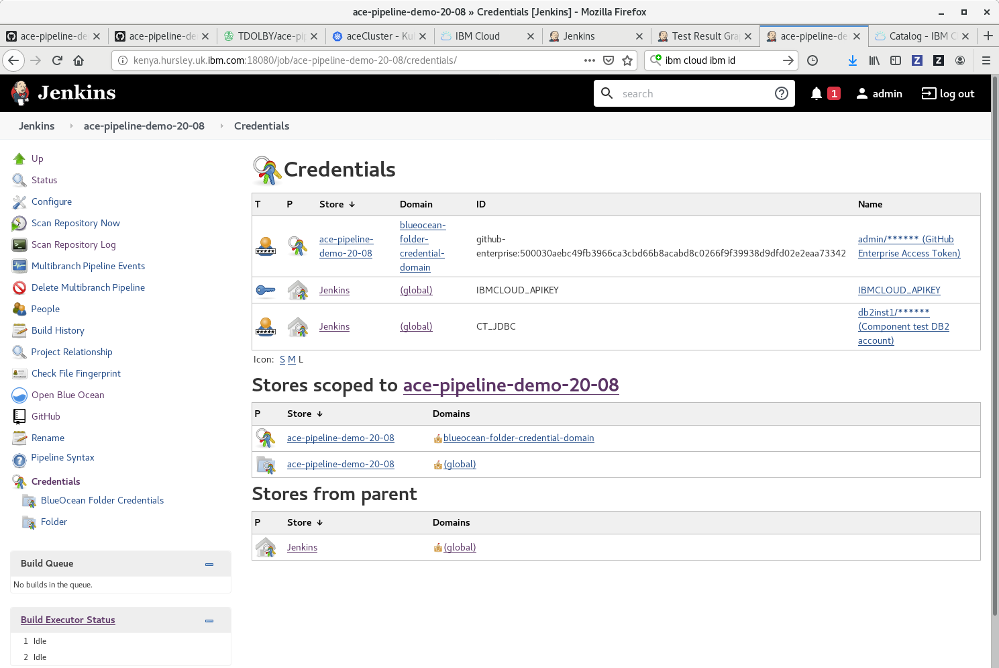
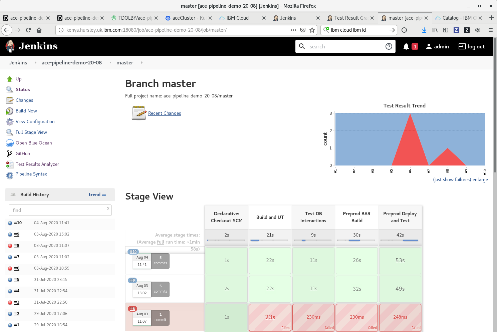

# Jenkins docker image

Tested with 2.235.2


To build:
```
docker build -t ace-jenkins-server .
```
Running the container:
```
 docker run --rm -ti -p 18080:8080 -p 40000:50000 -v /Development/tdolby/public-jenkins_home:/var/jenkins_home --privileged -v /var/run/docker.sock:/var/run/docker.sock ace-jenkins-server
```
Set an admin password, then install the "Blue Ocean" plugin (Manage Jenkins -> Manage Plugins) and optionally the "Test Results Analyzer" plugin for easier viewing of JUnit results.

The Jenkins docker container will be able to run docker commands on the host, which is how the "docker build" commands in the pipeline work. In anything other than a demo environment, other ways of building would be preferred (kaniko or equivalent) to avoid the Jenkins container having so much power.

## Credentials

Need CT_JDBC and IBMCLOUD_APIKEY for actual pipeline, and a GitHub API key for Blue Ocean to run the pipeline.

## Working setup for initial demo environment

For reference, the initial setup included

- Jenkins running in a container and accessible on kenya.hursley.uk.ibm.com:18080
- DB2 also running on kenya.hursley.uk.ibm.com:50000
- uk.icr.io/ace-registry as the IBM Cloud registry
- aceCluster running in Dallas (us-south) for the preprod tests
- local registry for ace-minimal:11.0.0.9-alpine built from https://github.com/ot4i/ace-docker/tree/master/experimental/ace-minimal

Jenkins credentials viewed from build page:



Jenkins classic (as opposed to Blue Ocean) view of the build:



Jenkins Blue Ocean plugin installed after initial server start:


