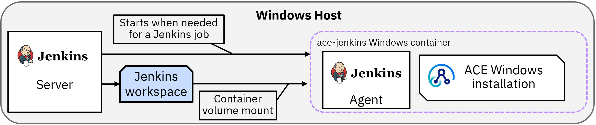
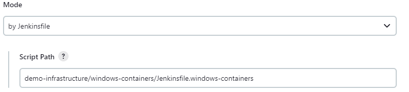

# Jenkins pipeline with Windows containers

Extends the Windows Jenkins pipeline [described here](../README-jenkins.md) to use Windows
containers instead of relying on an ACE install on the Jenkins VM. The Jenkins server must
have the Windows `docker` binary in PATH, and it must be set to use Windows rather than Linux
containers.

Jenkins itself runs as a process on the Window VM, while all the jobs are run in containers
started on-demand. The containers are transient rather than being static Jenkins nodes, and 
mount the Jenkins build workspace from the host:



## Building the ACE Jenkins container

The [ace-docker](https://github.com/ot4i/ace-docker/tree/main/experimental/windows)
repo contains an [ace-basic](https://github.com/ot4i/ace-docker/tree/main/experimental/windows/ace-basic)
directory that can be used to build a Jenkins agent container. See the ace-basic link for details 
on the image itself, and how it is constructed.

The repo must be cloned locally, possibly configured with a download URL (see 
[ace-basic](https://github.com/ot4i/ace-docker/tree/main/experimental/windows/ace-basic)),
and then the following command should be run in the experimental/windows/ace-basic directory
```
docker build --build-arg FROMIMAGE=jenkins/agent:windowsservercore-ltsc2019 -t ace-jenkins:12.0.11.0-windows  .
```
to create the ace-jenkins image used by this pipeline.

## Getting started with the pipeline

The steps are very similar to the pipeline linked above, with the main difference being 
during the setup of the "multibranch pipeline". For this variant, the pipeline should be
configured to look for `demo-infrastructure/windows-containers/Jenkinsfile.windows-containers`:



The Jenkins server must have the `Docker Pipeline` plugin installed for the pipeline syntax
to be recognized.