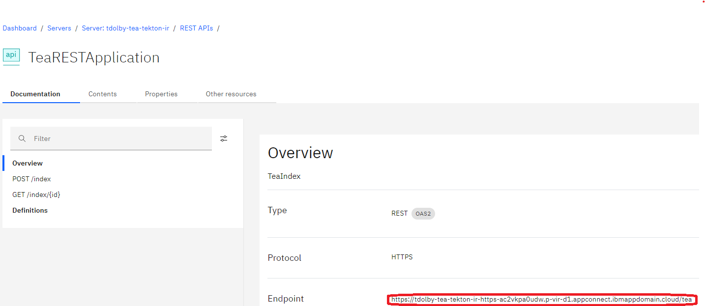

# Tekton pipeline

Used to run the pipeline stages via Tekton, and can deploy to either ACE containers 
or to ACE-as-a-Service:


The tasks rely on several different containers for all use cases:

- The Tekton git-init image to run the initial git clones.
- A build container, which would normally be one of the following:
  - The `ace-minimal` image (see [minimal image build instructions](minimal-image-build/README.md) for details).
    This image can be built from the ACE developer edition package (no purchase necessary) and is much
    smaller than most other ACE images.
  - The `ace` image from cp.icr.io (see [Obtaining an IBM App Connect Enterprise server image](https://www.ibm.com/docs/en/app-connect/13.0?topic=cacerid-building-sample-app-connect-enterprise-image-using-docker#aceimages__title__1) for versions and necessary credentials).
    This image is created by IBM and requires an IBM Entitlement Key for access.

For container deployments, more containers are used:

- [Crane](https://github.com/google/go-containerregistry/tree/main/cmd/crane) for building the application runtime images.
- lachlanevenson/k8s-kubectl for managing Kubernetes artifacts
- A runtime base image:
  - The `ace-minimal` image, which is the smallest image and therefore results in quicker builds in some cases.
    See [minimal image build instructions](minimal-image-build/README.md) for details on building the image.
  - The `ace` image, which should be shadowed to the local registry to avoid pulling from cp.icr.io too often.
  - For CP4i use cases, the `ace-server-prod` image (see [os/cp4i/README.md](os/cp4i/README.md) for CP4i details)
    which should also be shadowed to the local registry. The main instructions are contained in that README.

For ACEaaS, the target does not present as a container system (though it runs containers in the cloud):

- An ACE-as-a-Service (ACEaaS) instance needs to be available.

In general, using the default namespace for Kubernetes artifacts is discouraged, so a namespace
(such as `ace-demo`) should be created for the pipeline and runtime containers. The YAML files 
in this repo generally do not have namespaces specified (other than some CP4i files), so using
`oc project ace-demo` to set the default namespace should provide the correct results.

## Getting started

A Kubernetes cluster will be needed, with Minikube (see [minikube/README.md](/tekton/minikube/README.md)) and
OpenShift 4.14 being the two most-tested. Other clusters should also work with appropriate adjustments to
ingress routing and container registry settings. Note that the Cloud Pak for Integration (CP4i) has a separate
pipeline the creates IntegrationRuntime CRs with custom images; see [os/cp4i/README.md](/tekton/os/cp4i/README.md)
for more details.

Many of the artifacts in this repo (such as ace-pipeline-run.yaml) will need to be customized depending on
the exact cluster layout. The defaults are set up for Minikube running with Docker on Ubuntu, and may need
to be modified depending on network addresses, etc. The most-commonly-modified files have options in the
comments, with [ace-pipeline-run.yaml](ace-pipeline-run.yaml) being one example:
```
    - name: buildImage
      # Requires an IBM Entitlement Key
      #value: "cp.icr.io/cp/appc/ace:13.0.1.0-r1"
      # ace-minimal can be built from the ACE package without needing a key
      #value: "image-registry.openshift-image-registry.svc.cluster.local:5000/ace/ace-minimal:13.0.1.0-alpine"
      # Need to use the -build image for Maven
      #value: "image-registry.openshift-image-registry.svc.cluster.local:5000/ace/ace-minimal-build:13.0.1.0-alpine"
      value: "192.168.49.2:5000/default/ace-minimal-build:13.0.1.0-alpine"
```

The Tekton pipeline and ACE runtime rely on having permission to access the container registry,
and this may require the provision of credentials for the service accounts to use:

- Minikube container registry does not have authentication enabled by default, and so dummy
credentials can be used for the `regcred` secret. This is also true for ACEaaS as that does
need a container registry at all:
  ```
  kubectl create secret docker-registry regcred --docker-server=us.icr.io --docker-username=notused --docker-password=notused
  kubectl apply -f tekton/service-account.yaml
  ```
- OpenShift container registry does have authentication enabled, but this is integrated and requires
only that the service accounts have the `system:image-builder` role and dummy credentials can be used:
  ```
  kubectl create secret docker-registry regcred --docker-server=us.icr.io --docker-username=notused --docker-password=notused
  kubectl apply -f tekton/service-account.yaml
  ```
  It is also possible to use the logged-in user's token, which may be necessary in some cases:
  ```
  kubectl create secret docker-registry regcred --docker-server=image-registry.openshift-image-registry.svc.cluster.local:5000 --docker-username=kubeadmin --docker-password=$(oc whoami -t)
  ```
  See the "Openshift" section below for more details.
- External registries normally require authentication, and in that case the default runtime 
service account needs to be given the credentials:
  ```
  kubectl create secret docker-registry regcred --docker-server=us.icr.io --docker-username=<user> --docker-password=<password>
  kubectl patch serviceaccount default --type=json -p='[{"op": "add", "path": "/imagePullSecrets/-", "value": {"name": "regcred"}}]'
  kubectl apply -f tekton/service-account.yaml
  ```
The service account also has the ability to create services, deployments, etc, which are necessary for running the service.

As well as the registry credentials, the pipeline needs JDBC credentials to run the component tests. 
See [cloud-resources.md](cloud-resources.md) for DB2 on Cloud instructions, with the credentials being created as follows
```
kubectl create secret generic jdbc-secret --from-literal=USERID='blah' --from-literal=PASSWORD='blah' --from-literal=databaseName='BLUDB' --from-literal=serverName='19af6446-6171-4641-8aba-9dcff8e1b6ff.c1ogj3sd0tgtu0lqde00.databases.appdomain.cloud' --from-literal=portNumber='30699' 
```
with the obvious replacements.

### Tekton dashboard

The Tekton dashboard (for non-OpenShift users) can be installed as follows:
```
kubectl apply --filename https://storage.googleapis.com/tekton-releases/dashboard/latest/release.yaml
```
and shows pipeline runs in a UI:


By default, the Tekton dashboard is not accessible outside the cluster; assuming a secure host somewhere, the
dashboard HTTP port can be made available locally as follows:
```
kubectl --namespace tekton-pipelines port-forward --address 0.0.0.0 svc/tekton-dashboard 9097:9097
```

### Pipeline creation

At this point, the instructions split into two: for deployment to containers, see the following section.
For ACE-as-a-Service, see [ACE-as-a-Service target](#ace-as-a-service-target) below.

## Container deploy target


Setting up the pipeline requires Tekton to be installed (which may already have happend via OpenShift operators, in which case
skip the first line), tasks to be created, and the pipeline itself to be configured:
```
kubectl apply -f https://storage.googleapis.com/tekton-releases/pipeline/latest/release.yaml
kubectl apply -f tekton/10-ibmint-ace-build-task.yaml
kubectl apply -f tekton/20-deploy-to-cluster-task.yaml
kubectl apply -f tekton/21-knative-deploy-task.yaml
kubectl apply -f tekton/ace-pipeline.yaml
```
(note that the pipeline will run without the cluster being enabled for Knative serverless; the 21
task is only run if `knativeDeploy` is set to `true` when the pipeline is run).

Once that has been accomplished, the simplest way to run the pipeline is
```
kubectl create -f tekton/ace-pipeline-run.yaml
tkn pipelinerun logs -L -f
```

and this should build the projects, run the unit tests, create a docker image, and then create a deployment that runs the application.

Note that previous versions of the instructions suggested running
```
kubectl apply -f tekton/ace-pipeline-run.yaml
tkn pipelinerun logs ace-pipeline-run-1 -f
```
using a fixed name for the pipeline run, but using a generated name allows build history to be preserved.

### How to know if the container deploy pipeline has succeeded

The end result should be a running container with the tea application deployed, listening for requests on /tea/index at the
appropriate host and port. An HTTP GET on http://containerHost:containerPort/tea/index/1 should return some JSON, though the 
name may be null if the database has no entry for id 1.

For Minikube, the easiest way to access the container from the local machine is to run
```
kubectl --namespace default port-forward --address 0.0.0.0 svc/tea-tekton-service 7800:7800
```
and then access http://localhost:7800/tea/index/1. If Minikube ingress is enabled, then 
deploying `tekton/minikube/tea-tekton-minikube-ingress.yaml` will add the correct definitions
for the service to be made available that way.

Note that if errors of the form

```
BIP2230E: Error detected whilst processing a message in node 'gen.TeaRESTApplication.getIndex (Implementation).GetFromDB.Get DB record'.
BIP6233E: An error occurred in node: Broker 'integration_server'; Execution Group 'ace-server'; Message Flow 'gen.TeaRESTApplication';
Node 'getIndex (Implementation).GetFromDB.Get DB record'; Node Type 'GetIndex_JavaCompute There was a problem establishing a connection
to the given database URL: jdbc:db2://824dfd4d-99de-440d-9991-629c01b3832d.bs2io90l08kqb1od8lcg.databases.appdomain.cloud:30119/BLUDB:user=yyyyyyyy;password=xxxxxxxx;
Exception details: error message: [jcc][t4][2034][11148][3.71.22] Execution failed due to a distribution protocol error that caused deallocation of the conversation.
```
occur, then it is likely that the TEAJDBC policy is not configured to use SSL. Setting

```
<environmentParms>sslConnection=true</environmentParms>
```
in the policyxml should eliminate this error.

### OpenShift

The majority of steps are the same, but the registry authentication is a little different; assuming a session 
logged in as kubeadmin, it would look as follows:
```
kubectl create secret docker-registry regcred --docker-server=image-registry.openshift-image-registry.svc.cluster.local:5000 --docker-username=kubeadmin --docker-password=$(oc whoami -t)
```
Note that the actual password itself (as opposed to the hash provided by "oc whoami -t") does not work for
registry authentication for some reason when using single-node OpenShift with a temporary admin user.

After that, the pipeline run YAML should be changed to point to the OpenShift registry, and the 
pipeline run as normal:
```
kubectl create -f tekton/ace-pipeline-run.yaml
tkn pipelinerun logs -L -f
```
The OpenShift Pipeline operator provides a web interface for the pipeline runs also, which may be
an easier way to view progress.

To enable external connectivity from within OpenShift to enable testing, edit the `host`
setting in [tekton/os/tea-tekton-route.yaml](tekton/os/tea-tekton-route.yaml) to reflect
the correct namespace and domain name, then run
```
kubectl apply -f tekton/os/tea-tekton-route.yaml
```
to create a route. The resulting URL of the form http://tea-route-namespace.apps.mycompany.com/tea/index/1
should then access the Tea REST application in the container and show JSON result data.

### CP4i

See [os/cp4i/README.md](os/cp4i/README.md) for details on how to create IntegrationRuntime CRs for CP4i, along
with a pipeline that included running component tests in a CP4i container during the build to ensure that the
configurations are valid.

## ACE-as-a-Service target

See [README-aceaas-pipelines.md](README-aceaas-pipelines.md) for a general overview. The
Tekton pipeline for ACEaaS looks as follows, with the (optional) "Create configuration" steps
shown as a separate task that only runs when requested:


As there is no runtime container, this pipeline can run using the `ace` image as the 
build image; this requires an IBM Entitlement Key and the appropriate credentials:
```
kubectl create secret docker-registry ibm-entitlement-key --docker-username=cp --docker-password=myEntitlementKey --docker-server=cp.icr.io
```
Ensure that the ace-tekton-service-account includes the `ibm-entitlement-key` secret for both secrets
and imagePullSecrets. For those without an IBM Entitlement Key, the `ace-minimal` image will also work, and
the service account will not need to be changed.

Setting up the pipeline requires Tekton to be installed (which may already have happend via OpenShift operators, in which case
skip the first line), tasks to be created, and the pipeline itself to be configured:
```
kubectl apply -f https://storage.googleapis.com/tekton-releases/pipeline/latest/release.yaml
kubectl apply -f tekton/aceaas/40-ibmint-aceaas-deploy-task.yaml
kubectl apply -f tekton/aceaas/41-ibmint-aceaas-config-task.yaml
kubectl apply -f tekton/aceaas/aceaas-pipeline.yaml
```

The pipeline requires additional credentials to deploy to ACEaaS, and `aceaas-credentials` 
should be created using values acquired using the ACEaaS console. See 
[https://www.ibm.com/docs/en/app-connect/saas?topic=overview-accessing-api](https://www.ibm.com/docs/en/app-connect/saas?topic=overview-accessing-api)
for details on how to find or create the correct credentials, and then set the following 
```
kubectl create secret generic aceaas-credentials --from-literal=appConInstanceID=MYINSTANCEID --from-literal=appConClientID=HEXNUMBERSTRING --from-literal=appConApiKey=BASE64APIKEY --from-literal=appConClientSecret=HEXNUMBERCLIENTSECRET
```
The pipeline should create the required configurations based on the JDBC credentials
and other values if the createConfiguration parameter is set to `true`; this should only be used
for the first pipeline run or after any change to the credentials (see the "ACEaaS API rate 
limits" section of [README-aceaas-pipelines.md](/demo-infrastructure/README-aceaas-pipelines.md) 
for more information).

Once the required edits to `aceaas-pipeline-run.yaml` have been made (including setting the 
ACEaaS API endpoint, if not using the US East region), the simplest way to run the pipeline is
```
kubectl create -f tekton/aceaas/aceaas-pipeline-run.yaml
tkn pipelinerun logs -L -f
```

and this should build the projects, run the tests, and then deploy to ACEaaS.

### How to know if the ACEaaS pipeline has succeeded

Once the pipeline has completed and the integration runtime has started, the application can be
tested by using a browser or curl to access the application API endpoint. The endpoint can be 
found from the ACEaaS UI by examining the deployed REST API as shown:



The endpoint should be of the form `https://tdolby-tea-tekton-ir-https-ac2vkpa0udw.p-vir-d1.appconnect.ibmappdomain.cloud/tea`
and (similar to the integration node example above) curl can be used to retrieve or add data.
```
C:\>curl https://tdolby-tea-tekton-ir-https-ac2vkpa0udw.p-vir-d1.appconnect.ibmappdomain.cloud/tea/index/1
{"name":"Assam","id":"1"}
```
