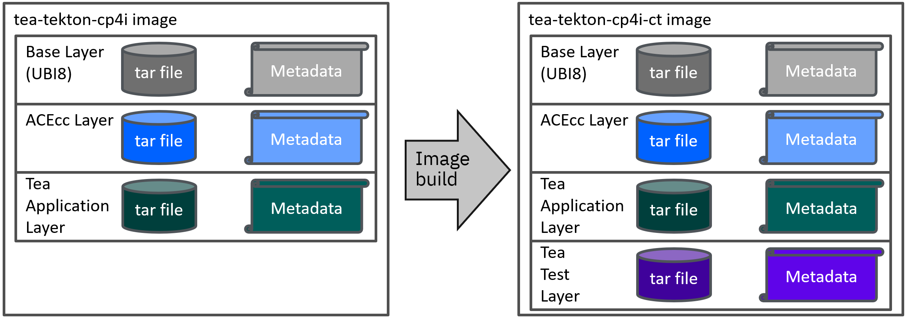
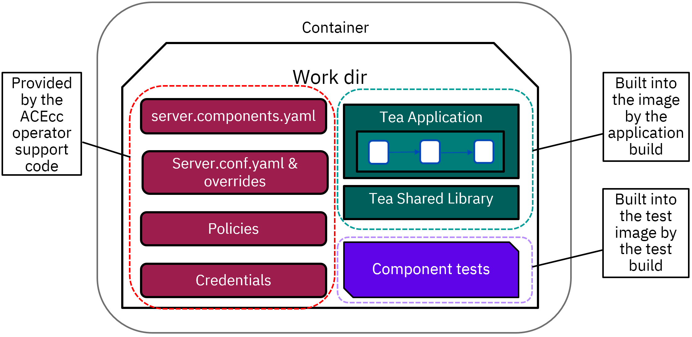

# CP4i pipeline

This pipeline is similar to the main project pipeline, but is designed to work with the Cloud Pak for Integration (CP4i) 
and uses the App Connect Enterprise certified containers for runtime. It also runs component tests in a CP4i container to
allow JDBC connections to be tested using the same CP4i configurations used by the deployed application itself.


## Container builds

The pipeline creates the main application image first, and then builds the component test image on top of the first image.
Crane is used to build both images in the pipeline, with ibmint or Maven building the applications and libraries.



## Component testing

The component testing itself relies on the operator support code (runaceserver) to create the correct policies and
credentials from the configurations provided. This allows the component tests to run with the same setup as the application
itself, ensuring the tests are providing useful results.



The test run strategy is as follows:

- Create a CR with MQSI_PREVENT_CONTAINER_SHUTDOWN set plus the database credentials configurations (and any other needed configurations) using the second custom image (the one with the tests), and let it start up.
- Stop the running server with kill -INT 1 (via kubectl exec) to cause the runaceserver code to shut the server down and then wait (due to MQSI_PREVENT_CONTAINER_SHUTDOWN  being set).
- Once the server is stopped, run a new server (using kubectl exec or whatever) that specifies the correct test project and any test options (like IntegrationServer -w /home/aceuser/ace-server --test-project SomeTestProject --start-msgflows false)
- Collect the output and return code from kubectl exec as usual, allowing the pipeline to stop on failed tests.
- Delete the CR, and then send another kill -INT 1 to make the runaceserver code exit.

See [13-component-test-in-cp4i-task.yaml](13-component-test-in-cp4i-task.yaml) for details on running the tests. Despite 
MQSI_PREVENT_CONTAINER_SHUTDOWN being set, there are still liveness probes running in the background, and these check for
port 7600 to be active. In most cases, the component test server will start quickly enough to be listening on port 7600
before the container is killed, but it is possible that very slow server startup (on an overloaded node, for example) 
could miss the required window. Setting `livenessProbe.failureThreshold` (see [Integration Runtime Reference](https://www.ibm.com/docs/en/app-connect/containers_cd?topic=resources-integration-runtime-reference)) to a large value should eliminate this issue.

Note that this approach splits responsibilities between the ACE operator (create the work directory and run the initial server)
and the ACE product itself (run the tests and report the results); the operator support code in the container does not know 
anything about running tests. 
- Anything that would also affect production (such as issues with CP4i configuration formats and other related matters) would fall under CP4i support.
- Issues with ACE application code, JUnit options, etc, would fall under ACE product support.
- As the tests are using the operator, the [ot4i/ace-docker](https://github.com/ot4i/ace-docker) repo is not involved, so issues should be 
  raised with product support (CP4i or ACE itself) rather than in that repo; ace-docker is now intended only for non-operator use cases.

## Pipeline setup and run

Many of the steps are the same as the main repo, but use the `cp4i` namespace. Security constraints are more of an issue
in OpenShift, but using crane avoids a lot of extra permissions seen with kaniko and buildah.

The pipeline assumes the CP4i ACE integration server image has been copied to the local image registry to make the
container builds go faster; the image must match the locations in the YAML files. See 
https://www.ibm.com/docs/en/app-connect/containers_cd?topic=obtaining-app-connect-enterprise-server-image-from-cloud-container-registry
for details on the available images, and it may be helpful to use port forwarding to pull and push the images from
a local system using a command such as 
```
kubectl --namespace openshift-image-registry port-forward --address 0.0.0.0 svc/image-registry 5000:5000
```
at which point the OpenShift registry will be accessible from localhost:5000.

As an example, the following sequence would tage the 13.0.4.0-r1 image and upload to the registry:
```
docker pull cp.icr.io/cp/appc/ace-server-prod:13.0.4.0-r1-20250621-111331@sha256:79bf0ef9e8d7cad8f70ea7dc22783670b4edbc54d81348b030af25d75033097e
docker tag  cp.icr.io/cp/appc/ace-server-prod:13.0.4.0-r1-20250621-111331@sha256:79bf0ef9e8d7cad8f70ea7dc22783670b4edbc54d81348b030af25d75033097e
 image-registry.openshift-image-registry.svc.cluster.local:5000/cp4i/ace-server-prod:13.0.4.0-r1-20250621-111331
docker push image-registry.openshift-image-registry.svc.cluster.local:5000/cp4i/ace-server-prod:13.0.4.0-r1-20250621-111331
```

Note that the ACE operator often uses the version-and-date form of the image tag when creating
containers, which would also work; the following tags refer to the same image:
```
cp.icr.io/cp/appc/ace-server-prod:13.0.4.0-r1-20250621-111331
cp.icr.io/cp/appc/ace-server-prod@sha256:79bf0ef9e8d7cad8f70ea7dc22783670b4edbc54d81348b030af25d75033097e
```

Configurations need to be created for the JDBC credentials (teajdbc-policy and teajdbc) and default policy project name
in a server.conf.yaml configuration (default-policy). See [configurations/README.md](configurations/README.md) for details.

The JDBC credentials also need to be placed in a Kubernetes secret called `jdbc-secret` so that the the non-CP4i 
component test can access them during the pipeline run. This step (`component-test` in [ibmint-cp4i-build](12-ibmint-cp4i-build-task.yaml))
proves that the code itself is working and connections are possible to the specified DB2 instance, while the later
[CP4i-based component test](13-component-test-in-cp4i-task.yaml) demonstrates that the configurations are also valid
and that the ACE server in the certified container can connect to DB2. 

Create the `jdbc-secret`

```bash
kubectl create secret generic jdbc-secret -n cp4i --from-literal=USERID='USERNAME' --from-literal=PASSWORD='PASSWORD' --from-literal=databaseName='BLUDB' --from-literal=serverName='19af6446-6171-4641-8aba-9dcff8e1b6ff.c1ogj3sd0tgtu0lqde00.databases.appdomain.cloud' --from-literal=portNumber='30699'
```

The Tekton pipeline expects docker credentials to be provided for [Crane](https://github.com/google/go-containerregistry/tree/main/cmd/crane) to use when pushing the built image, and these credentials must be associated with the service account for the pipeline. If this has not already been done elsewhere, then create them with the following format for OpenShift

```bash
kubectl create secret -n cp4i docker-registry regcred --docker-server=image-registry.openshift-image-registry.svc.cluster.local:5000 --docker-username=kubeadmin --docker-password=$(oc whoami -t)
```

Given we need to pull the ace prod image from `cp.icr.io` we need the entitlemnt in our openshift namespace. If `ibm-entitlement-key` needs to be created

```bash
oc create secret docker-registry ibm-entitlement-key \
 --docker-username=cp\
 --docker-password=<entitlement-key> \
 --docker-server=cp.icr.io \
 --namespace=<namespace>
```

Otherwise, if IBM entitlement key needs to be copied from one Namespace to another then

```bash
oc get secret ibm-entitlement-key -n SOURCE_NAMESPACE -o yaml | sed 's/namespace: SOURCE_NAMESPACE//g' | oc apply -n TARGET_NAMESPACE -f -
```

The service account needs `regcred` and `ibm-entitlement-key` associated with it. Also it needs the ability to create services, deployments, etc, which are necessary for running the service.

```bash
kubectl apply -f tekton/os/cp4i/cp4i-scc.yaml
kubectl apply -f tekton/os/cp4i/service-account-cp4i.yaml
oc adm policy add-scc-to-user cp4i-scc -n cp4i -z cp4i-tekton-service-account
```

Setting up the pipeline requires the tasks to be created, and the pipeline itself to be configured:

```bash
kubectl apply -f tekton/os/cp4i/12-ibmint-cp4i-build-task.yaml
kubectl apply -f tekton/os/cp4i/13-component-test-in-cp4i-task.yaml
kubectl apply -f tekton/os/cp4i/22-deploy-to-cp4i-task.yaml
kubectl apply -f tekton/os/cp4i/cp4i-pipeline.yaml
```

and to run the pipeline

```bash
kubectl create -f tekton/os/cp4i/cp4i-pipeline-run.yaml
tkn pipelinerun -n cp4i logs -L -f
```

## Results

If the pipeline is successful, there should be an integration server CR called `tea-tekton-cp4i` in the cp4i namespace.
A route should have been created, and the application can be checked by querying the URL

http://tea-tekton-cp4i-http-cp4i.apps.openshift.domain.name/tea/index/1

(with the appropriate domain name) to call the tea application.


## IntegrationServer CR

As of ACE 12.0.7, this pipeline creates IntegrationRuntime CRs for the application. It is also
possible to create IntegrationServer CRs (the default for previous releases), and the files to
do this are in the [integrationserver](integrationserver) directory. The two task YAML files
should be applied in place of the equivalent in this directory.