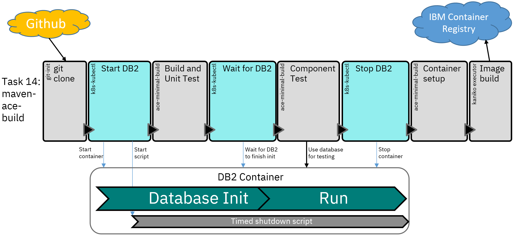

# Pipeline using temporary DB2

Modifies the main pipeline to use a separate
[DB2 container](https://www.ibm.com/docs/en/db2/11.5?topic=db2-containerized-deployments)
for each pipeline run, creating and deleting the container as part of the build.



The rest of the pipeline remains unchanged, with only the `maven-ace-build` task changing.

## Overview

The modified `maven-ace-build` task adds three new steps in order to run new DB2 database
for each pipeline run. Running a new database each time ensures that the test results are
repeatable and not influenced by previous test runs, but also requires more cluster resources
as a new database must be created and started each time.

As well as starting the database, the pipeline must stop it to free resources. This happens in
three ways:
- Explicit shutdown after testing is complete
- A timer running inside the container shuts the database down after 30 minutes
- A container left from a previous run is deleted when a new pipeline run starts

Once the database is up and running, the TEAJDBC policy is customized to point to the IP address
of the DB2 pod and (along with the userid/password) provided to the test. The task steps create
files that mimic the Kubernetes secret format, and the [init-creds](/demo-infrastructure/init-creds.sh)
script picks them up and uses them to configure the server.

### Task step details

#### start-db2
Calls [start-db2-container.sh](start-db2-container.sh):
- Checks for previously-started containers and deletes them
- Starts the DB2 container for this pipeline run
- Launches the shutdown timer script in the new container

#### wait-for-db2
Calls [wait-for-db2-container.sh](wait-for-db2-container.sh):
- Waits for the database container log to say "Setup has completed"
- Creates the credentials in /work/jdbc to be picked up by init-creds.sh

#### stop-db2
Calls [stop-db2-container.sh](stop-db2-container.sh):
- Deletes the DB2 container


## Advantages of a per-run database

Isolation between test runs has several benefits:
- Any changes to database tables can be tested without affecting all builds.
- Tests can update database tables without impacting other tests.
- Database dependencies are managed entirely within the build, without the need to keep
  track of which external databases are required for a build to be successful.

Although the component tests in this repo only trigger database reads, the use of 
temporary databases in the build would allow for inserts to be tested as well. This
is complicated to achieve with a shared database, and would require more complex logic
to ensure reliable tests.

There is also no need for external database credentials in the build pipeline when
using temporary databases, nor a requirement that such databases be accessible from
the test containers.

Note that although this implementation uses a fixed name and therefore can only have
one pipeline running at once, this could be changed to use the pipeline run name (or
other unique identifier) to allow greater scalability.

## Disadvantages of a per-run database

Resource consumption is the biggest disdvantage, as it causes some issues:
- The startup time for the DB2 container can be several minutes due to creating the 
  database, which can be significantly longer than the time required for the main part
  of the build.
- Smaller clusters may become unstable due to the additional disk, memory, and CPU 
  requirements of the DB2 container; in extreme cases, the `deploy-to-cluster` Tekton
  task may be unable to start.
- For DB2 specifically, the containers must be run with `privileged: true`, which may not
  be permitted in all environments.

## Getting started

The main change required is the updating of the `maven-ace-build` task to include the DB2 
container interactions; this requires applying the task YAML in this directory:
```
kubectl apply -f tekton/temp-db2/14-maven-ace-build-temp-db2-task.yaml
```
The task steps rely on the other files in this directory, but no other configuration changes
are needed and the pipeline can be run to verify the new steps and configuration are used.

## Notes

The main tekton service account has been adjusted to allow container logs to be queried, which is 
needed in order to determin ewhen the database has finished starting up.

Very small clusters may become unstable if multiple DB2 containers are run simultaneously; this is 
likely to be due to resource contention issues.
